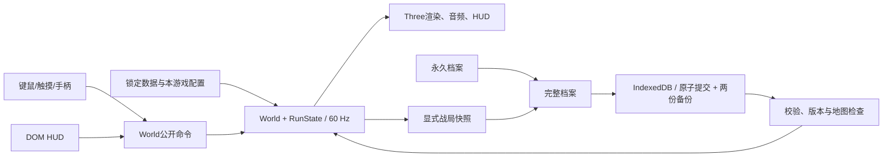

# 工程架构与开发边界 · V26

<!-- MVP10_PLANNING_ENTRY -->
**最新精英覆盖纠正：**1.0 MVP目标为每族10普通家族×每家族3款＝90款精英。现有40款只是当前实现/历史策划，不是完整目标；新增50款的机制与表现见[MVP精英补全稿](MVP10_ELITE_CATALOG.md)，待确认后实施。

**最新微操配点纠正：**微操与三条主线共用80点，每购买一级均占1点并使玩家等级增加1级；微操花费更多永久资源，点满17级花64资源、占17点。下文“是否占80点待定”“微操不影响玩家等级”等旧表述已被这一明确答复取代。

**MVP架构目标见[运行稿](MVP10_RUNTIME.md)和[总计划](MVP10_ITERATION_PLAN.md)。**M0 r6 已获确认。M1 建立单一 mvp-1.0／18关运行规则，M2 接入四线天赋和战局效果；旧开发战局只允许导出及核验后单独导入永久本金。保留一个 World、60Hz 固定步和事务模型。历史规则源码不进入新局运行路径。清理状态见 [M1 运行核验](project/M1_RUNTIME_AUDIT.md)。
<!-- /MVP10_PLANNING_ENTRY -->

天赋以已批准的[M0 r6逐节点稿](MVP10_TALENTS.md)为准：三条主线各41级，微操另17级，四线共用80级／80点。`mvp-talents.generated.ts`存165个稳定定义，`mvp-talents.ts`负责合法前置与报价，`mvp-talent-effects.ts`聚合单位效果；117节点模块仅供历史读取，不参与新局。

TypeScript＋Three.js＋Vite、DOM HUD、World唯一玩法状态、60 Hz固定模拟，保留现有引擎。新局及新档固定 mvp-1.0／18 关，战局中的三族编制状态非空；旧 v1 战局不进入 World。开局把活跃方案复制进 `RunConfig.frozenTalents`，战斗只读这份快照；局外洗点不改变在途战局。完整合同见 [BUILD_RESEARCH](BUILD_RESEARCH.md)。

## 三族模块边界

| 模块 | 职责 |
| --- | --- |
| data/races、expansion-units、campaign-science-vessel | 种族／家族、锁定数据和完整配方；SCI独立来源 |
| data/expedition-buildings、campaign18、mvp-talents | 科技前置、18关固定预算、165节点与前置价格 |
| simulation/expedition-state | 新规则唯一可变状态与校验，随RunState持久化 |
| expedition-production | 两产出轮换、逐乘员付款、设施归属、空投接收／事务换兵 |
| expedition-economy、progression/expedition-drafts | 发展／强化／保底／刷新、生命修复报价 |
| combat/expedition-combat、weapon-patterns、carriers | 护盾／隐形／侦测、医修、施法预约、实际多段武器、截击机归属 |
| combat/expedition-heroes、expedition-elites | 15英雄身份／技能、40精英路径与单次效果 |
| movement/native-traversal | 真崖边与合法端点、死神／巨像独立跨越、冲锋 |
| progression/permanent-profile、mvp-talent-effects | v4永久档案的九蓝图／单活跃投资账；本局效果派生不保留第二份等级 |
| ui/hud/expedition-panel、mvp-talent-panel | 种族、生产、换兵、发展目标、四线配点和逐级报价；不决定规则 |

实体的种族和阵营分别由 race 与 team 表达；旧 owner 暂作空间查询适配：terran 代表玩家、zerg 代表敌军，不代表单位物种。虫族玩家单位仍可对虫族敌军正确交战。新增生产走 FamilyId 逐乘员账本。旧 Job 字段尚留在源码中，但不能作为新局训练入口。

`requiresPlayerDecision`统一冻结精英／换兵，墙钟差值在暂停、失焦、加载／解码及恢复时重置。事务仅末尾通知，保存延到同步交易结束。逐乘员支付、换兵收据、保底历史、护盾、隐形、侦测、原生模式、子机补造、主巢事件均保存在显式DTO；渲染插值与Three对象不入档。

资源按当前种族、敌军、即将出现内容加载；离线包包含全部交付资源。源模型/截图不上传。下列目录和基础设施仍有效，旧版本段落仅作历史参考，不提供可续玩的旧战局分支。

模型延迟加载必须先登记共享Promise与排队任务，再通知同步HUD监听者；监听者再次请求同模型时复用任务，避免精英替换界面递归加载。地图强化领取复用World的事务通知边界：效果登记与掉落移除全部完成后才通知HUD／自动保存。精英选择期间提供保存、导出、返回标题，待选择身份继续随原战局保存。

## 目录职责

```text
src/
  main.ts                     样式、启动调用、启动错误显示
  app/
    bootstrap.ts              World/渲染/输入组合，帧循环、重开、页面生命周期
    run-session.ts            自动保存时机、继续槽、导入导出、保存状态
  data/                       版本锁定数值、本游戏调参、兵种/关卡/天赋/固定编制
  simulation/
    world.ts                  固定步协调、玩法交易、公开命令与检查点边界
    run-state.ts              每局可变状态；重开时更换，World身份保留
    persistence/              显式持久字段、检查点格式与版本
    combat/                   索敌、射线、状态、敌方技能及固定命中结算
    movement/                 地形查询、寻路、空间哈希、接触与出生位置缓存
    formation/                队形槽、交战展开
    progression/              奖励生成、永久天赋档案
  persistence/
    graph-codec.ts            Map/Set/共享引用/特殊计时值的可导出表示
    archive.ts                完整档案格式、校验、基本验证
    save-repository.ts        IndexedDB原子写入、两份备份、故障恢复
  render/
    scene/                    Three场景与只读World适配
    loaders/                  原模型材质、动作与挂点映射
    units/                    GPU骨骼实例、标签、仓、资源
    effects/                  粒子、原弹道、音频
    terrain/                  地表/地图显示与裁剪
    input/                    屏幕拾取到世界位置
    settings/                 画质
  ui/
    hud.ts                    HUD订阅、界面状态、动作分派
    hud/                      小地图、天赋/进化/建筑生产模板、存档控件
    controls/                 操作偏好、统一技能入口
    gamepad/                  手柄状态、映射、校准、菜单导航
    mobile/                   键鼠/触摸输入与指针生命周期
  assets/                     稳定资源ID、生成清单、离线解码
  diagnostics/                仅开发版可变诊断接口
test/                         规则、数据、存档、渲染适配的自动回归
tools/                        已有资源/地图/构建/诊断工具
  docs/                       从运行配置生成完整数据参考
reports/qa/                   可公开文字证据
reports/local/                本地日志、截图、运行素材报告（忽略）
assets/private/               原资源与处理输入（新增默认忽略；已跟踪项按LFS）
public/assets/                运行资源（忽略）
dist/                         Web与单文件离线产物（现有HTML按LFS，其余忽略）
```

V23拆出入口生命周期、存档协调与后端，分离天赋／进化模板，提取阶段开图和读档共用的出生缓存构建。V24在既有建筑商店中加入生产选择模板，选择由World验证、RunState保存。原有战斗循环保持在World，不额外引入通用ECS、事件总线或第二套规则框架。

## 数据与调用方向



UI调用意图／交易方法，不能直接扣资源或应用伤害。渲染读取World与有界视觉事件，不能决定命中、领奖或RNG。永久档案独立于RunState，但一个完整存档同时提交永久档案与战局，避免领奖收据错位。

## 固定模拟与生命周期

`FixedStepper`保留1/60秒步长与未处理时间债，每渲染帧最多8步，应用层给予12ms追赶预算。暂停、隐藏页面、选择和模型加载重置墙钟差值，不推进战斗；持续过载可能积压模拟，FPS不能单独证明实时性。

`World.resetRun()`创建新的RunState并重新初始化，保留World对象、监听者、控制设置与已加载GPU资源。`bootstrap`统一重置输入、手柄、音频、显示缓存和帧时钟，不使用 `location.reload()`重开。

`captureRun()`只选择明确归类的玩法字段；`restoreRun()`先在分离数据上验证，再替换同一World的每局状态。地图由原始SHA匹配，恢复后重建空间哈希／地图缓存，战斗先暂停。详见 [SAVE_SYSTEM.md](SAVE_SYSTEM.md)。

读档资源就绪从快照推导本关波次敌军、已启用的未来产出、未结算订单、现存单位与空投守军；这些模型的解码和GPU首用校验必须在确认继续前完成。仅预载快照中已经存活的单位会让第4关等中途读档在新敌军首次出现时发生主线程着色器校验长帧。资源清单只影响加载时机，不写入战局规则或改变存档格式。

## 规则模块

- 普通数值及速度换算：`data/sc2-units.ts`，锁定5.0.15导出快照。军衔、英雄、精英、天赋、难度、虫巢、无尽配置分别集中在对应data文件。
- 普通总编制与英雄席位：`data/roster.ts`。未来兵种目录增加不改总上限；当前每系规则由World统一计算。
- 地面可达、悬崖、坡道、远程遮挡共享TerrainQuery；原地图使用MapTerrain，CharTerrain仅为旧内置／诊断路径。
- 生产用共享Job锁定付款和参与建筑；运输舱持有乘员状态。每类建筑在关间选择一至两种已解锁产出，轮换只影响之后开工的批次。预付容量优先于新奖励，切换产出不能改写已付订单。
- `CombatStatuses`按目标／来源保存效果，用堆管理到期；序列化导出有效记录，恢复重建堆。
- `EnemySpecials`拥有预警、冲锋和弹道；同一扇形共享命中Set，避免重叠重复伤害。保存时只取DTO，不能序列化其World引用。
- 随机状态、ID、计时与累计取整属于玩法状态；寻路求解器、空间桶、编队临时结果属于可重建状态。`MapTerrain`的A*费用、前驱与搜索代数数组每张地图复用，不入档；阶段变化清除路线与可达图，连续搜索用代数隔离旧数据。`SpatialHash`重建时同时写入完整桶、阵营桶和地面／空中桶；避让只查询同层桶，接触碰撞保留完整桶的原候选顺序。两次重建之间发生模式切换会使分层桶失效，本步回退至按当前飞行标记过滤的完整桶。

## 原模型与表现

`AnimatedBatch`用AnimationMixer采样原骨骼，再用半浮点骨骼矩阵纹理播放多个独立实例。24Hz原动作采样、大型／友军插值、共享材质及可选原网格LOD保留。LOD仅改变原网格索引，不用几何体替代单位。三族普通家族、死亡与已有变形模型共享原LOD判定；英雄和精英维持完整模型。

`mapAnimations()`处理原动作语义；劫掠者明确左右手与Ready，不再取第一个含attack的片段作为全部行为。GLTFLoader为绑定把空格改成下划线，因此枪口同时解析原名与规范化名。实际出弹序号决定手，动作与枪口一致；Walk清除，站定允许原动作收尾。原始M3/GLB字节未改。

V24的诺娃装配只在运行时校正原GLB中枪骨的局部偏移，保留原贴图和动作，并只显示当前使用的步枪网格；英雄／友军精英通过不同的边缘光、环形标记、枪口闪光与姓名样式辨识。原素材字节不变，表现不改变命中或伤害。

V25为最多三名英雄绘制实例化地面信标；世界标签使用现有原头像和本局英雄状态，投影、避让和触摸穿透留在 `FriendlyLabels`。技能提示读取模拟已有的施放时间，不增加玩法事件、伤害或存档字段。减少动态资源创建；新标签和信标随原World及渲染循环更新。

视觉事件自有有界序号，不消耗玩法ID或RNG。死亡拷贝、粒子和声音不参与伤害。逐发时间使用模拟lastShotAt，暂停不继续播放。原始粒子组成、材质动态与动作混合仍属网页适配，不声称等同原客户端。

地图与单位脱离相机视域可不绘制，但模拟照常运行。清理运输舱只释放独立骨架，不释放共享纹理与模型。重新部署保留已解码资源。

## 持久化与界面

`RunSession`决定何时保存、保存状态及继续槽；`SaveRepository`只负责读写与轮换备份；`archive`负责完整格式；图编解码只接受显式DTO。它们不依赖Three对象。

HUD由World变化事件更新，保持原有10Hz战斗通知。存档提交状态单独通知HUD，不占用战斗场景。存档入口限标题、暂停、设置、关间和结束界面；默认焦点优先继续战局。错误以可读文本显示，原始导入内容不作为HTML执行。

55节点天赋、进化与建筑生产面板是独立纯模板；生产选项与购买规则仍在World／TalentProfile。界面只显示规则结果，不另写一套可购买性判断。

## 资源与离线交付

素材版本5.0.16.97563与数值版本5.0.15分开锁定。CASC/M3/DDS来源、散列、转换记录留存；原美术与截图只在本地。资源ID稳定，缺失必需原模型使打包失败，不远程生成替代品。

离线构建从同一 `src/main.ts`打包，按内容散列共享不可变字节块，gzip无损编码、HTML安全Base85内嵌、本地解码成Blob URL。原动作／贴图不因当前未使用而删除。字体使用系统回退。F1和修改状态API只编译到开发版，离线包只公开只读报告。

## 文档与验证工作流

1. 读DESIGN确定授权范围与当前行为，再改有直接职责的模块。
2. 战斗／存档改动添加必要的行为回归；普通文案／可逆布局不为凑数量写测试。
3. 运行 `npm test`、`npm run typecheck`；数据变更后运行 `docs:data`，交付前 `docs:check`。
4. `npm run build`生成真实产物；浏览器验证加载、动作、交互、错误与适用的离线流程。
5. 截图、性能原始日志留本地，公开摘要与完整命令写QA；最终大小／散列写STATUS。
6. 不把自动通关当普通难度标准，不把截图保存或headless通过当人工视觉认可，不把桌面触摸仿真当手机真机。

性能优化必须有同条件测量。当前结构调整减少职责耦合，不据此宣称FPS提高。没有云存档、多窗口合并或通用跨版本迁移框架。
