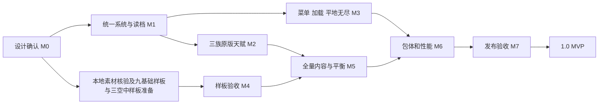

# 通向 1.0 MVP 的完整迭代计划

版本：2026-09-24 / 设计基线 r6。状态：**M0已获用户确认，M1待实施**；确认不等于玩法、模型、画面或性能已验收。

本轮规划以 `D:\星际` 当前 V26 为起点。今天交付的是完整设计稿和已经建立的项目管理文件，不修改游戏规则、资源、用户存档或可玩包。这里的“1.0 MVP”是本轮全部发布门槛通过后的版本，不是现有 V26 的改名。

## 1. 阅读入口与设计效力

| 稿件 | 回答的问题 |
| --- | --- |
| 本文 | 本轮做什么、分几阶段、依赖与完成条件是什么 |
| [三族天赋逐节点设计](MVP10_TALENTS.md) | 三族各48主节点与7微操节点的效果、数值、前置、消费与互斥 |
| [运行流程、读档、无尽、加载设计](MVP10_RUNTIME.md) | 一套系统、菜单、难度、平地无尽、加载条及失败回退 |
| [90精英、18英雄与资源优化设计](MVP10_COMBAT_ASSETS.md)及[精英补全目录](MVP10_ELITE_CATALOG.md) | 既有40款＋新增50款逐项规则/模型表现、英雄加强、素材、包体与性能 |
| [项目管理入口](project/README.md) | 任务状态、审批、变更、责任、检查与发布制度 |
| [任务清单](project/BACKLOG.md) / [决策记录](project/DECISIONS.md) | 哪些任务已完成、哪些等待设计确认、怎样开始下一阶段 |
| [验收矩阵](project/ACCEPTANCE.md) | 每项要求如何验证、什么证据才能关闭 |

优先级：用户最新确认 → 已确认设计及其变更记录 → 执行任务 → 运行配置和生成参考 → 历史报告。当前源码只证明现状，不反过来决定用户想要的设计。`SYSTEMS_REVIEW_20260924.md` 中用户修订的原版节点，是三族适配的起点；本轮新增数字已随M0 r6获批准；尚未写入运行配置。

三份详细稿不是各自另起一套系统。它们共享本计划、同一份已确认决策表和一个任务库。确认时记录文档修订号/散列、接受范围和例外；用户自行修改文档也需核对差异、同步依赖任务，不能拿旧生成器覆盖。

## 2. 本轮固定范围

| 要求ID | 用户要求 | 本轮目标 | 主阶段 |
| --- | --- | --- | --- |
| R00 | 当前天赋做三族完整适配 | 保留三条原主线的机制，三族逐节点规格；主线每条可点41级，微操可点17级；四线共用80点，微操单列效果与高资源价 | M2 |
| R01 | 不保留多套系统兼容旧档 | 一套18关/三族/天赋/交易/无尽规则；开发旧战局退出运行入口，档案政策明文说明 | M1 |
| R02 | 精英和英雄靠模型、弹道、命中表现特殊 | 每族10家族×3款＝90精英＋18英雄候选（三族各6，本局仍招3名）；精英共享三型体型/局部色相/实际攻击效果，按统一强化模板保证战力，九个基础样板＋三族空中英雄样板先验；去掉统一紫色染色与巨大姓名牌 | M4、M5 |
| R03 | 无尽前关间选择 | 胜利结算→整备/选择→加载→无尽；撤离、保存等待、继续均明确 | M3 |
| R04 | 无尽大平地、真实SC建筑 | 独立平地地形与寻路数据，原建筑模型，加载失败不进入战斗 | M3 |
| R05 | 读档不改变难度 | 已保存run配置唯一权威；四难度跨默认设置往返，标题/HUD/倍率/奖励一致 | M1、M7 |
| R06 | 英雄更强、范围和技能更有感 | 原15英雄逐名普通攻击与技能提案＋每族各1高阶空中英雄（战列巡洋舰、利维坦、净化者航母），强度与视觉分别验证 | M4、M5 |
| R12 | 玩家爆虫自爆后存活 | 仅玩家普通/精英爆虫爆后保留身体并停止5秒；敌方仍死亡；模拟时间、保存、动画按单次事件结算 | M2、M4、M5 |
| R07 | 包体优化 | 已有去重基础上裁剪真正无用依赖/动作、优化贴图；保留单HTML离线入口 | M6 |
| R08 | 新游戏/读档/天赋的菜单流程 | 三族真实SC贴图及特色、难度、天赋冻结；读档直接恢复所选战局 | M3 |
| R09 | 预加载用读条承接卡顿 | 分阶段真实进度，必要资源和GPU预热完成后才能开始；新游戏、读档、无尽共用加载协调器 | M3、M6 |
| R10 | 先文档确认再落地 | 设计/参数审批门槛、变更记录和文档对照检查 | M0及全阶段 |
| R11 | 项目管理落地 | 本地可版本管理的任务库、依赖、验收、决策和发布清单；不引入外部协作账号 | M0及全阶段 |

继续保留：TypeScript＋Three.js＋Vite、World唯一玩法状态、60Hz固定模拟；三族30普通家族、18英雄候选（三族各6，本局仍招3名）、每家族3款共90精英；五家族槽、每家族基础五身体/五军衔；天赋可扩至七身体/七军衔；三英雄身份；18关/1800秒；接收时事务换兵；付费持续生产；免费基础强化一选；基础侦测；离线保存。

不扩入本轮：24关长战役、多人、云档、账号、第二引擎、赛季和新增付费货币。新界面与特效不成为修改碰撞、自动模式、伤害来源或锁定地图坐标的借口。

## 3. 已核对的起点与风险

以下属于当前文件/既有报告的证据，不等于本轮重新跑过所有测试。

| 项目 | 已知现状 | 计划处理 |
| --- | --- | --- |
| 天赋 | 当前仍运行未经确认的117节点/50点代码 | 先批准三族原机制适配稿，再替换唯一运行配置与界面，删除旧分支 |
| 原版成本 | 主线层价1/1/1/2/1/3/5；每线41点/59资源；微操17级/64资源 | 自动检查价格、计点、前置及退款，不把80点写成固定资源总价 |
| 双系统 | `expedition === null` 等旧12关/旧商店/旧天赋路径仍在 | 列依赖后逐个退役；共享功能保留，旧系统测试改为拒绝旧开发档的入口测试 |
| 无尽 | 当前有“进入无尽”按钮，但没有专门整备窗口；地图加载失败可继续进入无尽状态 | 实现专门过渡状态与加载成功事务，失败保持胜利整备 |
| 地形 | Acropolis运行地形有高度、层级、坡道，非大平地 | 新独立平地配置，不复用旧高度数据后只换贴图 |
| 建筑 | 当前防御建筑为自制几何体 | 替换为经核验的SC建筑本体；缺资源时任务阻塞，不冒充完成 |
| 无尽时长 | 三族路径静态审计发现仍从终关配置取150秒和关卡调度 | 显式240秒无尽轮次和独立调度，永久资源仍按战斗分钟结算 |
| 难度 | difficulty在快照字段中；只读World往返四难度均保留；浏览器问题尚未复现 | 查读档入口/默认设置/UI缓存/旧槽选择整链；不凭猜测宣布修复 |
| 用户提到的10倍速档 | 已找到的三份导出均是简单第7关、endless为空，非目标无尽档；10倍速仅开发诊断 | 记录未复现，后续用明确的入口与存档制造回归场景 |
| 包体 | 当前HTML 440,973,335字节，约420.545MiB；745资源；已有82,645,306字节去重 | 建立派生资源体积账，不重复认领已有收益 |
| 普通性能 | 既有单HTML首关三族均值约58FPS、P95 16.8ms，首次使用180–233ms长帧 | 加载门槛＋热点实测；未达到用户稳定60+目标 |
| 高压 | 既有300敌夹具约34–38FPS | 独立跟踪，不能用普通场景或逻辑测试冒充高压性能验收 |

现有产物：`D:\星际\dist\SC2-Survivors-Demo.html`。上述HTML的历史交付散列为 `6855597b49ec3dcf956dcf5f8747d978cae5fbc7a1a5eed1e6772509e8edc17d`，本轮规划不重新构建。来源：[既有QA](QA.md)、[最近构建记录](../reports/qa/elite-receipt-20260924.json)、[普通性能记录](../reports/qa/ground-sparse-optimization-20260924.json)、本轮两份专项核验稿。

## 4. 天赋和经济的统一合同

1. 采用资源管理、强化士兵、军队管控三个机制主线；每族各16×3主节点，微操每族7节点，不另造117节点树。三族定义共144主线节点＋21微操节点＝165个可审阅定义。
2. 三条主线与微操每增加1级均占共享80点中的1点，玩家等级等于四线当前总投入，上限80。主线各层收费1/1/1/2/1/3/5；41点完整一线花59资源。没有独立经验升级，也没有高价微操一次占多点的规则。
3. 微操第1—7层每级花1/3/3/6/3/6/10永久资源；满17级花64资源、占17点，余下最多63点可分给三条主线。更高价格只花更多已有永久资源，不增加新币或资源获取倍率。
4. 洗点全额退实付；切预设先校验新方案、资源足够才原子退旧付新。九份方案仅一份激活，不重复锁钱、叠效果或让局内冻结树变化。
5. 已确认的原节点及特殊前置保留：SCV救星3级、出金大师击杀独立概率与分支门槛、精英教室不同等级的分支门槛、精英培训/死战不退前置。种族化不借机删掉这些玩法。
6. 基础五身体/五军衔与天赋七身体/七军衔共存。军队终极不套用117树的“至少31点、双终极禁止”。合法性以本稿对应前置图和80点总额为准。
7. 免费基础三选一、原免单/寻找精英/出金大师的交集必须按PD02完整审批。保底、刷新、额外领取、付费精英、地图强化分别记收据，不能在UI里临时决定。
8. 永久资源获取不改：简单/普通战役每3关1、困难每3关2、地狱每关1；无尽每60秒简单/普通1、困难/地狱2；暂停/关间/加载不计时、不设新上限。

所有逐节点对象、叠加、召唤/精英/英雄例外、前置、概率与方案样例见[完整天赋稿](MVP10_TALENTS.md)。不能只实现这一节的摘要即报天赋完成。

## 5. 分阶段实施

### M0 — 设计冻结与管理基线（已确认）

工作：盘点实际运行分支和资源；建立R00–R12与任务/验收映射；交付三族165节点、90精英、18英雄候选和运行流程全稿；列出具体设计决定；保存现有工作区状态与当前产物指纹，不重置用户修改。

产物：本计划、三份专项稿、任务库、决策表、验收矩阵、只读文档检查器。门槛：用户批准对应修订内容；未确认的设计任务保持BLOCKED_APPROVAL。本轮用户已确认r6设计稿，M0审批可关闭；实现和运行验收仍须按后续任务逐项完成。

### M1 — 收敛一套运行系统，先解决存档与难度

工作：

- 建立唯一MVP规则配置、单一主树档案和run配置；campaign/endless是同一系统的两个模式，不是两套存档兼容引擎。
- 梳理旧12关、旧35席默认、旧多购商店、旧117树、旧生产付款结构的调用与共享代码。保留仍使用的公共算法，删除仅用于兼容的运行分支、入口和派生打包依赖。
- 将现有 `World` 对象身份、逐乘员支付、退款/领取收据、固定步和统一暂停边界保留；不因系统收敛重写整个引擎。
- difficulty、race、规则版本、冻结天赋、地图ID/散列成为run配置；读取时以档内值为准，新游戏默认值只服务新游戏。恢复前校验、恢复后重建派生难度表并同步UI。
- 落实批准的旧开发档处理：不后台覆盖/删除旧档，不维持旧战局引擎；永久本金的只读导入/备份与一次性收据独立处理，错误不取默认值悄悄开始普通难度。

阶段替换顺序：M1先收敛战局、旧商店、旧生产和存档入口；117节点模块在M2新天赋模块就绪时一次替换，期间不新增临时树或第三套规则。M1的可玩验证先用零天赋，原版天赋正式恢复以M2完成为准。

代码入口：`simulation/world.ts`、`run-state.ts`、`persistence/run-fields.ts`、`run-snapshot.ts`、`app/run-session.ts`、`persistence/archive.ts`、`save-repository.ts`、旧/新progression模块和其测试。逐模块删除清单随任务记录，不靠全文删“legacy”字符串。

可运行增量：唯一18关新局可开、四难度存取正确、旧开发战局能得到明确拒绝/导出提示。阶段门槛：重复导入不增资源；加载不回血/回盾/重抽；简单/普通/困难/地狱跨相反菜单默认值各通过；精英救援三选一死锁回归通过。禁止以“没有玩家”省略当前存档安全性。

### M2 — 原版三主线三族适配与经济闭环

工作：

- 按批准稿接入144主节点＋21微操节点、全部数值与前置；数据定义、效果解释器、UI预览同源。
- 实装四线合计80投入/等级、分层计价、实际投资账、全额洗点、九预设原子切换、开局冻结。价格与点数分别保存/校验，微操一等级只占一点。
- 恢复五→七身体、五→七军衔；培养上限、生产预留、继承记录、精英席位、阵亡/临时兵统走同一容量检查。
- 接入原经济机制及种族对象：工人救援、免单/双建造/完工、付费精英特约、击杀掉卡、英雄开局选择；所有随机判定使用保存的玩法RNG与幂等收据。
- 将微操放入单列页签，显示四线共用的已投入点数/80和本线高资源价。实际射程、瞄准/走射、部署、空运、APM弹道按逐节点边界实现，不能只改变UI文字。
- 把talent sources与hero buffs分开；同名buff先累加后应用，不重复给母舰及截击机。保留普通武器/科技/军衔次序。
- 仅玩家爆虫自爆后留场并停止5秒；敌方爆虫仍死亡。模拟、动作、保存、读档和精英效果按[战斗稿第9节](MVP10_COMBAT_ASSETS.md#9-三族空中英雄英雄强化与友方爆虫r6)统一验收。

代码入口：`data/talents.ts`及唯一新配置、`progression/*talent*`、`ui/hud/*talent*`、`expedition-production.ts`、`expedition-economy.ts`、`progression/expedition-drafts.ts`、`combat/weapon-patterns.ts`等实际效果调用点。

可运行增量：三族能完整配点、洗点、切预设，原三主线效用实际发生；三选一基础规则及天赋例外可从UI完整操作。门槛：165定义计数/数值检查，80/81边界，三条主线分别点满费用、微操满级费用与混合80点方案校验，逐节点效果用适用测试而非只比较配置；存档读取不变价、不重复触发奖品。31+19不再作为新树验收。

### M3 — 菜单、加载、无尽整备与真正的大平地

工作：

- 标题只放“新游戏 / 读档 / 天赋”三个主入口；设置可用次级按钮。新游戏页展示三族SC原贴图、明确特色、难度、天赋摘要；返回不启动/覆盖战局。读档列表直接读所选档，绝不重新走选族/选难度。
- 新游戏/读档/无尽使用同一LoadingCoordinator：清单→读取→解码→实例准备→GPU上传/编译→校验→就绪；显示可核验的真实阶段进度。
- 完成第18关双条件只结算一次，进入胜利整备；明确撤离/保存后再决定/整备并进入无尽。候选方案新增一次无尽前发展与强化窗口（仅选择无尽整备才生成），不重复第18关奖；此额外窗口随PD05确认。刷新页面或读档仍停在这一步，不自动确认。
- 创建独立160×160候选平地，平面寻路/地面高度/边界一致；移除Acropolis作为新无尽依赖。固定防御建筑换为核验的SC模型；外观与实际碰撞/射程各有参数。
- 使用240秒无尽轮次、终章混合敌军、侦测/对空和既定永久资源分钟奖励。清理战场敌人与地表同时，保留军队/伤损/身份/订单/钱包/未解决空投；具体转场映射遵守专项稿，不吞已付款乘员。
- 任何必要地图/模型失败停留读条错误页，可重试/返回；不得设endless非空后仍在旧地图。加载期间不推进模拟、不扣资源、不计奖励时间。

代码入口：`ui/hud.ts`与菜单模板、`app/bootstrap.ts`、`app/run-session.ts`、`assets/offline-pack.ts`、`render/scene`、`data/endless.ts`、World阶段命令、地形/存档验证。

可运行增量：三个菜单入口、四难度/三种族新局与读档，手动进入真实平地无尽，离线失败可恢复。门槛：与[运行稿](MVP10_RUNTIME.md)状态机一致；目标地图ID/散列/碰撞都平地；第一轮240秒；原SC建筑证据及人工画面验收齐全；加载中不出现模拟积债。

### M4 — 九个基础样板与三族空中英雄样板

样板：人族焚烧恶火、猎舰维京、雷诺；虫族宽刺潜伏者、广域破坏者、德哈卡；神族屏障不朽者、强电圣堂、菲尼克斯。另做三族空中英雄专项样板：大和战列巡洋舰、HotS利维坦、净化者旗舰。每族包含一个新增二号或三号精英，覆盖火焰、反甲空战、穿透弹、地刺、胆汁、近战吞噬、护盾、风暴与重型能量球。

工作：

- 精英三款共享家族出现权重；首次得到家族精英机会时在同一张卡内选择一款，只付一次价并锁定本局变体，取消可返回、不消耗机会。新50款按[精英补全目录](MVP10_ELITE_CATALOG.md)逐款实现，不能按家族只接一号。
- 精英按同家族三型共享配方：适度模型尺度、局部肤色/装甲色、原弹体/治疗束的芯径和短命中反馈；不逐款制作复杂模型/粒子。英雄普攻保留有力量的可读弹道/挥击/出枪节拍，命中来自同一次模拟命中事件。
- 删除统一紫色覆盖和硕大常驻姓名；固定英雄槽保留身份/血盾/冷却，战场默认仅小标识/选中说明，不用大标签遮挡模型。
- 先将视觉参数与真实伤害/范围分离，在相同敌人/距离/镜头下记录普通/精英/英雄对比。应用批准的样板强化数字，同时验实际命中边界。
- 对敌方危险预警设独立可读层；粒子有上限和复用池，减少装饰时保留弹道主体与落点。音效有短并发限制，不以全屏闪光/屏震掩盖出手。
- 样板增加友方爆虫自爆后留场的真实动画，不能播放死亡或把其从编制删除。

可运行增量：可在真实战斗验证九基础样板及三族空中英雄样板，不只是展厅静图。门槛：用户对模型差异、弹道爽感和预警可读性确认；同场帧时/伤害记录无回退。若不满意，在样板阶段修改稿后再扩充，避免108项全部返工。

### M5 — 全量90精英、18英雄与三族平衡

工作：按[精英补全稿](MVP10_ELITE_CATALOG.md)先统一增强五种精英模板、复用三型表现配方，再逐行落实90款的唯一专属效果、原主体/挂点和18名英雄数值；角色身份、普通攻击层、技能范围、伤害次数、治疗对象和控制/Boss衰减分别校验。完善原肖像与种族选择贴图，不能用同一肖像换名字充数。

英雄候选三族各6，本局最多招3名；阵亡占身份、升级不复活；恢复能力和增伤只作用一次。潜伏/隐形英雄必须保留侦测对抗。范围更大时遵从真实命中几何，不放大范围指示而仍打单体。18人详细值和效果来自审批稿，不现场临时加伤害。

三族新舰分别为大和战列巡洋舰、HotS利维坦、净化者旗舰；前两者的锁定原SC战斗模型必须取得和验收。航母机群的成长、付费及复活单次结算；大和炮、三段生体风暴、舰首核爆使用真实弹体/命中收据。泰凯斯火、诺娃冰作为少量可辨特殊攻击样板，具体效果以批准稿为准。

九Build做经济/动作可达复测，再进行普通自然游玩与代表章节实战；评价招到英雄前后击杀速度、有效治疗/护盾、技能利用、是否压过全部普通阵容及补员成本。不能通过必抽卡、赠矿或暗调敌人补救构筑。

可运行增量：三族完整内容和新天赋能打完18关、整备进无尽。门槛：90/90精英及18/18英雄规则、素材、动作、命中、身份和本地人工检查逐项关闭；精英Rank1与同家族普通Rank5同条件输出/治疗按批准的统一模板达标，五级成长和真实战役不能只看静态倍率；九Build有可达记录；未取得适用原模型的项仍阻塞，不能以脚本加载成功结案。

### M6 — 包体、预加载、普通战斗和高压性能

工作：

- 先沿资产manifest和运行引用图删旧系统/旧无尽的派生依赖；源文件、编辑工程和唯一备份不能当废物删。资源别名/动作名和多个挂点实际引用均检查。
- 从模型内贴图、未用动作、过大的JSON、重复网格/材质入手，逐个候选对照。当前已做图片去重+gzip+Base85，不能再把82.6MB计成新收益。
- 每次改动记录raw bytes、压缩后pack bytes、HTML bytes、解码CPU、启动峰值/稳定内存和画质变化；体积下降不等于战斗FPS提升。新增BattlecruiserEX2与HotSLeviathan真模型及其动作/贴图必须计入包体与首用预加载。
- 优先解决首用模型/技能/地图材质的长帧；加载条承接必要解码/GPU准备。做缓存命中和内存上界；每关只准备真正即将出现内容，不在开局强制加载全部18英雄90精英。
- 根据CPU/GPU profile优化渲染提交、粒子/透明叠绘、静态地图、重复上传与实例化；有证据才改碰撞/索敌热点，保持60Hz和相同命中/路径行为。
- 性能场景含0/41/80点、未扩编25普通与扩编35普通、3英雄、合法截击机、敌群，以及普通1–6关、终章、平地无尽。原地图与无尽分别测。

候选体积门槛：单HTML≤380MiB，目标≤320MiB；已随PD06批准，当前尚未实现。不得为达体积删除已承诺单位/英雄/有效动作，也不得破坏断网加载。

普通60+是发布要求，不用极限夹具替代。具体测法与门槛见第7节和验收矩阵。高压另记性能曲线；如正常终章/无尽本身达不到60+，仍为发布阻塞，不准改称“极端情况”绕过。

### M7 — 候选版验收，全部通过后进入1.0 MVP

工作：在冻结代码/数据/资源清单上执行规则、存档、流程、离线、输入、视觉、性能及实际玩法验收；缺陷只作有文档对应的修复；重新检查受影响内容，不为凑“通过数量”反复跑无关测试。

门槛：R00–R11全部有验收证据；无阻断/严重缺陷；三族从菜单→18关→选择→平地无尽完整可玩；天赋与资源不失真；简单读档不变普通；55内容有人工表现确认；正常前关/终章/无尽60+通过；包体/离线/资源就绪门槛通过。没有“模型以后补”“天赋数据表完成算完成”的豁免。

产物：`D:\星际\dist\SC2-Survivors-Demo.html`、Web目录构建、已批准设计快照、资产清单、实际命令/结果、构建字节/SHA256、已知限制和回退资料。只在门槛通过后把界面/版本/发布记录标为 **1.0 MVP**。不创建公开发布或推送任务。

## 6. 依赖与并行方式



M6的资源体积/性能基线从M0开始收集，但正式优化验收必须包含M5新增表现和M2扩编。M2与M3可并行，修改World公共命令/DTO需指定一个整合负责人，不能各自复制全套状态。M4样板可以在只读测试场景提前准备，未确认参数不进入正式战役。

每张任务以可审阅的小增量结束；进行中工程任务最多3张（规则、运行/UI、美术/资源各一），整合/发布任务一次1张。出现共享状态冲突先收敛接口，不让多个代理同时改同一World事务。阶段验收失败仅退回相关阶段，不重开已确认需求。

## 7. 统一技术与验收标准

### 7.1 数据与交易

- 规则定义中区分`allocationCost`与`resourceCost`，投资账记实付；UI只提交意图。每个接口校验phase/revision/合法对象/余额/容量/重复收据。
- 运行与永久档案继续一次IndexedDB事务写入，并保留两份轮换备份；旧开发档退出支持不等于降低新档可靠性。
- 阶段、加载、选择、失焦均重置墙钟；simulation time不包含玩家思考和GPU编译。恢复总是暂停。
- 行为/视觉事件带sourceActorId、sequence、target/hit geometry，渲染不抽玩法随机数、不决定命中和资源。
- 修改公开字段后更新显式save/rebuild列表；UI缓存和Three对象不入档。模式差异通过配置，不复制新World或并行旧系统。

### 7.2 普通游玩60+的测法

参考机沿用已有Ryzen 7 5800U/Radeon，1440×900、DPR1、原画质、实际硬件浏览器；记录供电/浏览器版本/后台负载。390×844仅窄屏布局/触屏仿真，不能当手机实机性能。

- 三族各测新开局1–3关完整180秒，4–6关完整225秒；正常生产、救援、施法、掉落和打开/关闭菜单，不注入敌军替代普通玩法。
- 第10–12、16–18关和平地无尽至少各一段180秒可重复样本；包括英雄/精英第一次上场、变形和新技能第一次施放。代表0/41/80点及7人家族。
- 读条结束后的最初10秒仍计入结果，不剪掉首次长帧；加载画面单列成本。每个基准至少三次同种子比较，保留最差值及中位数。
- 60Hz受刷新率限制时：P95帧间隔≤16.9ms、P99≤20ms、>20ms帧≤1%，报告实际呈现接近60；不能宣称证实了“超过60”。高刷新/不受60Hz封顶的实际环境补证平均≥60FPS。应用主线程工作P95目标≤14ms，连续战斗不出现由资源准备造成的>50ms长任务。
- 180秒样本新增模拟欠账≤0.1秒且不逐段累积；不把跳过固定步、降AI/命中频率或自动改敌军量作为优化。固定步误差与有意暂停单独记录。
- 300敌/35普通/3英雄/截击机压力测试独立显示，报告CPU/GPU/渲染次数/内存/积债。若为合成极端夹具须明确标签；实际正常波次不得用该标签豁免60+。

以上阈值是具体候选验收合同，随PD06确认；用户已要求的普通60+方向本身不待重新授权。当前旧证据未通过这些门槛。

### 7.3 视觉与输入

1440×900和390×844分别检验：识别三英雄来源、看见精英模型差别、判定弹道去向/命中、危险预警不被遮挡；默认不需展开巨型姓名才能找人。键鼠、触屏、手柄都能完成菜单、天赋、生产、换兵、选卡、无尽选择和取消；读条与弹窗不丢焦点。模拟手柄通过不替代物理设备结果；无法完成的人体验收保持待验。

### 7.4 最终命令

以下是未来发布必须执行并留结果的命令，不是本轮规划已执行的声明：

```text
node tools/check-mvp-plan.mjs
npm run typecheck
npm test
npm run docs:data
npm run docs:check
npm run build
npm run test:browser:save
npm run test:offline:save
```

新增场景脚本见任务库：talent-contract、difficulty-roundtrip、menu-flow、endless-transition、loading-ready、hero-elite-presence、ordinary-performance。采用现有Playwright/tsx工具，不引入第二测试框架。先写批准设计，再实现与之对应的可观察验收，不把生成的运行表冒充策划稿。

## 8. 已确认决策与启动条件

完整值见[决策记录](project/DECISIONS.md)。重点包括：三族逐节点适配内容；微操与主线共用80点已经确认；原免单/寻找精英/出金大师如何接入现有窗口；18英雄加强及90精英表现；无尽160×160/原SC建筑配置；旧开发档处理；体积/帧时目标。

这些具体方案已由用户通过M0 r6确认；相应任务按依赖直接推进，不重复询问。凡改变已确认机制、数值、获取途径或视觉方向，先提交设计差异及影响，再按确认落地。普通代码缺陷修复在既定合同内不需要重新策划。
